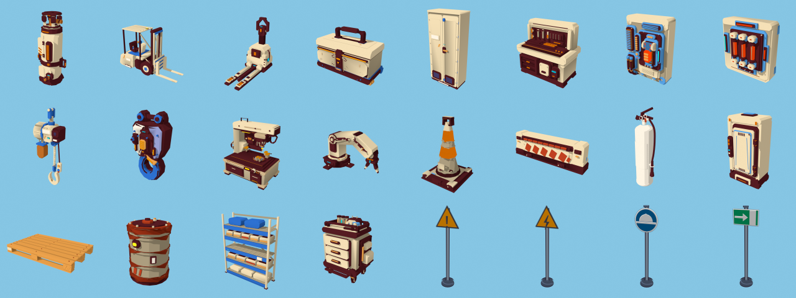

# Direction artistique « Panthère » — parcours du hangar

Référence fournie : *Pink Panther: Pinkadelic Pursuit* (PS1, 2002), niveau **The Construction Site**
(vidéo de 4 min 25, 1280×720). But : donner au **parcours** du Village Talas (le jeu de plateforme du hangar
d’assemblage A320, `buildPlatformer()` dans `village-talas-scene.html`) l’identité visuelle de ce niveau,
sans toucher au level design, aux collisions ni aux messages ISO 45001.

> Droits : aucune image, texture ni capture du jeu de référence n’est versionnée. Les images extraites pour l’analyse
> restent dans `tools/forge/out/ref-pink/` (ignoré par git). Tous les dessins livrés sont **peints par du code** dans
> `talas-panthere.js`, d’après les principes relevés ci‑dessous.



## 1. Ce que dit la référence

Relevé sur 34 images de la vidéo, avec les couleurs mesurées sur des zones de 11×11 à 13×13 px.

| Élément | Observation | Traduction pour Talas |
|---|---|---|
| **Fond** | Ciel cyan uni, puis une ville en silhouettes monochromes bleues (2 valeurs), fenêtres en tirets clairs, antennes, panneaux ; aucune perspective atmosphérique réaliste | Ligne d’horizon **de l’île** : hangars à toit courbe, tour de contrôle de Talas, grues à tour, dérive d’avion, palmiers. Même bleu, mêmes tirets |
| **Sol** | Bleu saturé (#0e91d7) peint à grands coups horizontaux, reflets clairs ondulés ; pas de sol « réel » | Sol époxy repeint en bleu brossé. L’allée piétonne jaune reste (ISO 45001), en bandes peintes légèrement de travers |
| **Bois** | Planches orange (#eea34c → #f3b866), veinage long, nœuds concentriques brun foncé, clous, jours sombres entre lames | Toutes les plateformes (`checker`, la tôle larmée disparaît) et les rampes deviennent des planchers de chantier |
| **Palissade** | Planches verticales à nœuds et traverses | Les cloisons de zone bleues et blanches deviennent une palissade |
| **Brique** | Rouge peint (#c14120), joints clairs, **coulures de mortier crème** en tête de mur | Les volumes bâtis (`cladding` : mezzanine, abris) passent en brique |
| **Plâtre / piliers** | Pêche moucheté, dessus crème, **flancs bordeaux** (#561c22) | Cloisons en plâtre moucheté ; lumière hémisphère à sol rose‑bordeaux pour assombrir flancs et dessous |
| **Métal** | Poutrelles bleu‑violet mat à rivets ronds, tuyaux gris | Charpente et poutrelles `steel` repeintes |
| **Géométrie** | Rien n’est droit : poteaux penchés, planches de biais | Déjà présent dans le parcours (`rand(-a,a)` sur les poteaux) : conservé |
| **Rendu** | Aplats saturés, ombrage doux, **pas de contour** sur le décor, grain de texture PS1 agrandie | Pas de contour encre sur le décor ; grain léger dans chaque peinture |
| **Interface** | Pièces roses marquées, cœurs, chrono `2'45"00`, polices cartoon | Déjà là dans le parcours (pièces « S », cœurs, chrono, Luckiest Guy) : conservé |

### Palette

| Rôle | Couleur | | Rôle | Couleur |
|---|---|---|---|---|
| ciel | `#86c6e4` | | brique | `#c14120` / `#9e3216` |
| ville (proche) | `#2e72d2` | | joint / mortier | `#e98a5c` / `#f6e1b7` |
| ville (lointaine) | `#5aa7ea` | | plâtre | `#e8b99a` / `#cb8a75` |
| sol | `#0e91d7` / `#3aa8ea` / `#0a74b4` | | flanc bordeaux | `#561c22` |
| planche | `#eea34c` / `#f3b866` | | acier | `#6c73a6` |
| nœud du bois | `#7a3f14` | | rose | `#f58ab4` |

## 2. Mise en œuvre

### Textures peintes (`talas-panthere.js`)

Le parcours peint déjà ses textures sur canvas (`PTD[clé] = [largeur, hauteur, peintre]`, mises en cache par `ptBase`).
Le module fournit des peintres **sous les mêmes clés** : aucune géométrie ni collision ne change.

| Clé | Surface dans le parcours | Nouveau dessin |
|---|---|---|
| `hangar` | grand fond parallaxe (420 × 30 m) | ciel + ligne d’horizon de l’île |
| `sky` | fond de scène | dégradé cyan |
| `floor`, `floor2` | sol, sol lointain | bleu brossé + allée jaune peinte |
| `checker` | plateformes, rampes, nacelle | plancher en planches |
| `wood` | cabine rose d’Aurelien (teintée) | planches à nœuds |
| `crate` | caisses | caisse peinte, « A320 FRAGILE » au pochoir |
| `cladding` | volumes bâtis | brique à coulures |
| `concrete` | cloisons, murs | plâtre moucheté |
| `steel` | charpente, poutrelles | acier bleu‑violet riveté |
| `yellow`, `hazard` | garde‑corps, montants, bandes | jaune sécurité peint |
| `skin` | tronçons de fuselage | apprêt vert anis en aplats peints (identité A320 conservée) |
| `check` | carrelage du magasin EPI | damier rose et vert de travers |
| `fence` (nouvelle) | cloisons de zone | palissade |

### Crochets dans le jeu (6 crochets, tous gardés par `window.TALAS_DA`)

1. `<script src="talas-panthere.js">` après `talas-config.js` ;
2. `TALAS_DA.patch(PTD, PT_NOPAINT)` avant `paintOver` (remplace les peintres) ;
3. brume, lumière hémisphère et soleil lus dans `TALAS_DA.scene` ;
4. la photo `hangar-fond.jpg` n’écrase plus le fond peint ;
5. les rayons de verrière sont omis (on est dehors) ;
6. `zone()` : palissade au lieu des panneaux bleus et blancs.

Sans le module, ou avec `?da=classique`, le jeu retrouve exactement l’ancienne direction.
`?da=panthere` la force. Le choix par défaut se règle avec `window.TALAS_DA_DEFAUT` avant le chargement.

### Personnages (Dylan, ouvriers, Georges, Bernard, Aurelien, le chien)

Même dessin que la référence, appliqué à tous les personnages du mini-jeu par `TALAS_DA.cartoon()`. Le crochet passe par
`toon()` dans `buildPlatformer()`, par le chien, et par les EPI au moment où Dylan les enfile.

| Trait de la référence | Mise en œuvre |
|---|---|
| aplats francs, une seule ombre | `MeshToonMaterial` à dégradé deux tons (ombre mauve `#c4b4c4`, lumière blanche), couleurs de rôle conservées, plus de couleurs de sommets |
| trait d'encre fin et sombre | coque inversée gonflée le long des normales (épaisseur constante), encre `#2b1623` ; ni pupilles ni bouche cernées |
| silhouettes longilignes | jambes ×1,24 (Bernard ×1,12), bras ×1,14, buste affiné ×0,9, corps relevé d'autant ; la pose animée par le jeu n'est jamais touchée |
| grands yeux expressifs | yeux ×1,28 |

Le décor suit la même logique : `TALAS_DA.decor()` tire les flancs et les dessous vers le bordeaux. Les faces tournées vers la
caméra et les dessus restent intacts, comme les dalles crème à flancs bordeaux de la référence.

### Accessoires 3D (forge)

Les couleurs des accessoires passent par des **rôles** (voir `README.md`). Une direction artistique est une palette
de familles de rôles : `palettes/panthere.json` (`gris_clair*` → crème, `bleu_nuit*` → bordeaux, `orange*` → bois…),
plus un style (`outline: false`, fond cyan).

```bash
node tools/forge/forge.mjs build --da panthere          # aperçus dans out/apercu-panthere/, galerie-panthere.html
```

```js
// en jeu
const pal = await (await fetch('tools/forge/palettes/panthere.json')).json()   // ou recopiée dans talas-panthere.js
const c = TalasProps.make('chariot-elevateur', TalasProps.themePalette('chariot-elevateur', pal), { gradientMap: grad, outline: 0 })
```

Les panneaux ISO 7010 portent `"theme": false` : **leurs couleurs sont réglementaires et ne sont jamais recolorées**.
Les GLB ne changent pas selon la direction artistique : seule la palette appliquée au chargement change.

## 3. Vérification

- Peintres rendus sur canvas et **injectés dans la page publiée** du jeu (navigateur intégré) : parcours reconstruit avec
  les nouvelles textures et le décor parcouru de x = 45 à x = 175. Plateformes, poteaux, palissade, sol, fond et caisses
  vérifiés à l’image.
- Script du jeu : les scripts en ligne sont compilés sans erreur après modification. Le diff se limite à ces 6 crochets.
- Forge : 24/24 accessoires valides avec le lecteur du jeu, et `test-props.mjs` vérifie aussi la palette « panthere »
  (tout rôle non lumineux a sa couleur, les `lum_*` restent intacts).

## 4. Pistes suivantes

1. **Deux plans de fond** : ville lointaine et ville proche sur deux plans à parallaxe différente (la référence en a deux).
2. **Couleur par orientation de face** : dessus crème, flancs bordeaux, piloté par la normale dans le shader
   (`onBeforeCompile` sur `MeshLambertMaterial`) plutôt que par la seule lumière hémisphère.
3. **Accessoires dans le niveau** : remplacer une partie des caisses, fûts et boîtes à outils primitives par les GLB de la forge
   avec `themePalette`.
4. **Écrans de chargement** : bandeau rouge et cadre doré façon « THE CONSTRUCTION SITE, PART 1 » pour la carte de titre du parcours
   (`chantierCard()`).
5. **Personnages** : fin contour sombre sur Dylan (référence : la Panthère est cernée, pas le décor).
