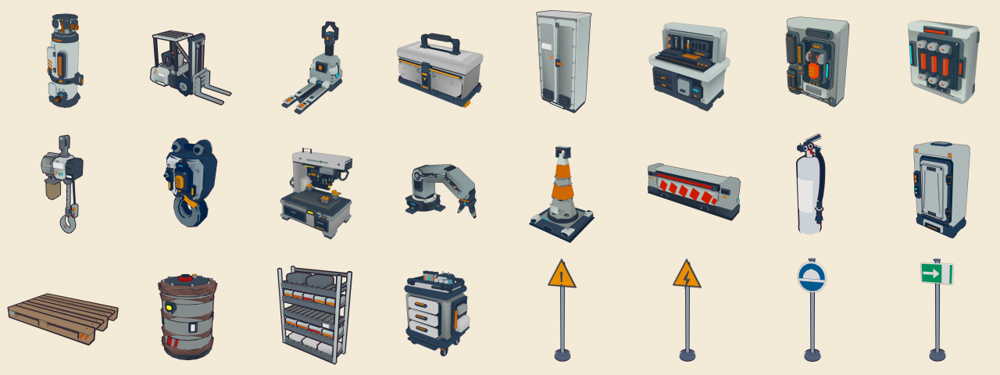

# Forge Talas — infrastructure de modélisation et de génération d’assets

Chaîne outillée qui fabrique les accessoires 3D du **Village Talas** à partir de deux sources :
les modèles procéduraux de **[vibe3d](https://github.com/vibe-stack/vibe3d)** (177 prototypes industriels,
80 éléments F1) et des **modèles maison** écrits en code. Tout sort au format que le jeu sait lire,
au rendu toon du jeu, validé par le lecteur GLB du jeu lui‑même.



24 accessoires générés en ~40 s (4 en parallèle) : hangar, atelier, risques électrique / chimique / incendie,
levage, balisage, secours et signalisation ISO 7010.

---

## 1. Constat (état du jeu au 27 septembre 2026)

| Élément | Constat | Conséquence pour la forge |
|---|---|---|
| Moteur | three.js **r128** chargé depuis cdnjs, script classique, `WebGLRenderer` | Pas de WebGPU ni de TSL côté jeu : tout doit être « cuit » en données glTF simples. |
| Lecteur 3D | `loadGLB()` maison dans `village-talas-scene.html` (pas de GLTFLoader) | Lit : nœuds **TRS**, maillages indexés, `NORMAL`, `COLOR_0`, `TEXCOORD_0`, `baseColorFactor`/texture, nom de matériau, `doubleSided`, `alphaMode`. **Ignore** `matrix`, skins, animations, extensions. |
| Style | `MeshToonMaterial` + dégradé 4 paliers (`#8a8a8a → #fff`), contour encre en coque inversée ×1,06, trame finale | L’aperçu Blender reproduit ces trois éléments. |
| Couleurs | personnages : maillages `piece__role`, couleur par rôle via `TPAL`, `COLOR_0` multiplié | Même convention pour les accessoires, plus un `.roles.json` par asset. |
| Échelle | personnages ≈ 1,7 m, bâtiments ≈ 5 m : **mètres**, Y vers le haut | Chaque asset reçoit une hauteur réelle (`height`) dans le catalogue. |
| Décor | ~680 `new THREE.*` inline (231 `BoxGeometry`, 158 `CylinderGeometry`) | Gros gisement : remplacer des primitives par des accessoires détaillés et réutilisables. |
| Outils existants | scripts Blender pour la hache, le sable, le scaphandrier, le récif, le bateau, l’atlas ; **pas** de scripts pour les GLB Talas | La forge rend la production Talas reproductible et versionnée. |

## 2. Pistes étudiées

| Piste | Verdict |
|---|---|
| **vibe3d → GLB** (`exportStaticGlb`) tel quel | ✗ bake de l’usure vers des textures : exige un canvas (absent de Node) et donne un rendu PBR sci‑fi hors style. |
| **vibe3d → conversion toon maison** (retenu) | ✓ Node pur, sans GPU ; récupère la couleur de base (`aColor`) et l’occlusion (`aMask.y`) que vibe3d calcule déjà. |
| Rendu headless vibe3d (Dawn / WebGPU natif) | ✗ sur ce PC : `win32-x64.dawn.node` demande `dxcompiler.dll`, absente. Non retenu : il rendrait en PBR, pas en toon Talas. |
| **Blender 5.2 en `--background`** (retenu) | ✓ déjà l’outil du dépôt ; décimation propre, export glTF, rendu toon fidèle (Shader to RGB + rampe constante + coque inversée). |
| Rendu dans le navigateur (three r128) | ✓ `banc-essai.html` pour l’œil humain ; pas d’automatisation ici (les connexions locales sont bloquées dans l’environnement de l’agent). |
| Génération par IA texte → 3D (Meshy, Tripo…) | ✗ pour ce projet : topologie et couleurs incontrôlables, pas de pièces nommées, style à reprendre. À réserver aux formes organiques. |

## 3. Architecture

```
                         catalogue.json  (id, source, hauteur, budget, variantes)
                                │
          ┌─────────────────────┴─────────────────────┐
  vibe3d:assets/…/model.ts                 local:models/*.mts  (createModel(params, THREE))
          └─────────────────────┬─────────────────────┘
                                ▼
  1. toon-export.mts   Node + tsx de vibe3d, sans GPU
     · anatomie : `parts` du contrôleur vibe3d (imbrication conservée) ou enfants nommés
     · couleur par triangle (aColor > couleur de sommet > matériau), stylisée « dessin animé »
     · rôles nommés en français (orange, bleu_nuit, gris_clair2…), lumineux → `lum_*` (non éclairés)
     · COLOR_0 = ombrage cuit (1 − 0,55 × occlusion), base au sol, centrée, mise à l’échelle
     · GLTFExporter en **TRS**  →  out/raw/<id>.glb + <id>.roles.json
                                ▼
  2. blender_stage.py  Blender --background
     · budget de triangles : décimation pondérée (≥ 48 triangles par maillage, détails préservés)
     · aperçu toon Talas : 4 paliers, rôle × COLOR_0, contour encre  →  out/apercu/<id>.png
                                ▼
  3. validate.mjs      charge le GLB avec **le loadGLB extrait du jeu**
     · refuse : nœud en `matrix`, skin, maillage sans rôle, rôle absent du .roles.json,
       nœud piece__role vide, valeurs non finies, dépassement de budget
                                ▼
  4. dépôt             assets/talas/props/<id>.glb + <id>.roles.json   ·  out/rapport.json  ·  galerie.html
```

### Contrat « accessoire Talas » (v1)

- GLB binaire, mètres, Y vers le haut, **base à y = 0, centré en X/Z**, face avant vers +Z.
- Hiérarchie : racine → **pièces** (`Group`, transformations TRS, animables par leur nom) → maillages **`piece__role`**.
- Couleur = rôle. `baseColorFactor` porte la couleur linéaire du rôle, `<id>.roles.json` sa valeur sRGB (`hex`) et `unlit`.
- `COLOR_0` = ombrage cuit (multiplicateur gris). Pas de texture, pas de skin, pas d’animation.
- Rôles `lum_*` = voyants et écrans : `MeshBasicMaterial` en jeu.

## 4. Utilisation

Prérequis : Node 22+, [vibe3d](https://github.com/vibe-stack/vibe3d) cloné **à côté** du dépôt (`../vibe3d`) avec `bun install`,
Blender 4.2+ (détecté automatiquement sous Windows, macOS et Linux). Variables facultatives : `VIBE3D_DIR`, `BLENDER`.

```bash
node tools/forge/forge.mjs list                        # le catalogue
node tools/forge/forge.mjs build                       # tout (≈ 40 s)
node tools/forge/forge.mjs build extincteur cone       # une sélection
node tools/forge/forge.mjs validate                    # revalide assets/talas/props avec le loadGLB du jeu
node tools/forge/test-props.mjs                        # intégration talas-props.js (rôles, recoloration, contours)
python -m http.server 8765                             # puis http://localhost:8765/tools/forge/banc-essai.html
```

`tools/forge/galerie.html` (ouvrable directement) montre chaque aperçu, ses rôles et ses mesures.
`tools/forge/out/rapport.json` résume chaque build (triangles, poids, taille, pièces, avertissements) : c’est l’interface pour un agent.

### Ajouter un asset vibe3d

Une ligne dans `catalogue.json` :

```json
{ "id": "pompe", "source": "vibe3d:assets/prototypes/industrial-pump/model.ts", "height": 1.1, "maxTris": 3000, "tags": ["atelier"] }
```

### Écrire un modèle maison

`models/<nom>.mts` exporte `createModel(params, THREE)`. `THREE` est fourni par la forge, donc rien à installer.
Les enfants nommés de la racine deviennent les pièces. Voir `models/panneau-securite.mts` :
un seul fichier, quatre variantes ISO 7010 via `params` (`kind`, `picto`).
Règle utile de vibe3d : jamais deux faces visibles coplanaires, décoller chaque couche de quelques millimètres.

### Utiliser en jeu

```html
<script src="talas-props.js"></script>
```

```js
await TalasProps.preload(['extincteur', 'panneau-danger-electrique'])
const ext = TalasProps.make('extincteur', { gris_clair: '#e03131' }, { gradientMap: grad, outline: 1.04 })
ext.position.set(3, 0, -2); scene.add(ext)
TalasProps.make('servante-outils').userData.parts.door_left.rotation.y = -1.2   // pièces animables
```

`make(id, palette, options)` suit la logique de `toonFromGLB` : couleur par rôle (surchargeable comme `TPAL`),
`MeshToonMaterial` avec le dégradé du jeu, rôles `lum_*` non éclairés, coque encre facultative.

## 5. Problèmes rencontrés et corrigés

| Problème | Détection | Correction |
|---|---|---|
| `GLTFExporter` écrit les nœuds en `matrix` ; `loadGLB` ne lit que TRS : objet de 7 m mal placé en jeu | validateur (le lecteur du jeu) | export `trs: true` + règle dans le validateur |
| Kits vibe3d pas à l’échelle réelle (bouteille de gaz de 7 m) | taille dans le rapport | `height` par asset dans le catalogue |
| Noms de pièces en double → `piece___role` : rôle lu `_blanc`, donc magenta en jeu | validateur | suffixe numérique, jamais `__` dans un nom de pièce |
| Décimation uniforme : petits détails réduits à zéro triangle (nœud vide) | validateur + aperçu | décimation pondérée (≥ 48 triangles), suppression des maillages vidés |
| Contour d’aperçu plus épais qu’une plaque de 4 mm : panneaux noirs | aperçu | épaisseur bornée par la plus petite dimension du maillage |
| `use_even_offset` du contour : pointes géantes sur coins dégénérés | aperçu | désactivé |
| Pièces vibe3d = lots de matériaux (`mat_02_ink_950…`) | test d’intégration | anatomie du contrôleur (`parts`), sinon filtre fonctionnel (porte, tiroir, levier, charnière…) |

## 6. Directions artistiques

Une direction artistique = des textures de niveau peintes par code + une palette de rôles pour les accessoires.
Première direction : **« Panthère »** pour le parcours du hangar, d’après *Pink Panther: Pinkadelic Pursuit* (PS1).
Voir [`DA-panthere.md`](DA-panthere.md) : analyse de la référence, palette, crochets du jeu, `build --da panthere`.

## 7. L’île et les comptes rendus

Refonte de l’île (avion, ateliers, végétation, rochers, vie) et outillage de capture vidéo sans serveur local :
voir [`ILE-refonte.md`](ILE-refonte.md).

## 8. Limites et suite

- **Direction artistique** : vibe3d est sci‑fi (gris‑bleu, orange). La stylisation et la recoloration par rôle le rapprochent de Talas,
  mais une palette par thème (hangar Airbus, infirmerie, bureau) dans le catalogue reste à décider avec l’auteur du jeu.
- **Pas d’animation cuite** : le lecteur du jeu ne lit ni skin ni clips. Les pièces nommées suffisent pour portes, tiroirs, leviers, mât de chariot.
- **Poids** : 4,4 Mo pour 24 assets (Float32 non compressé). Piste : quantification des positions (`KHR_mesh_quantization` exigerait d’étendre `loadGLB`),
  ou fusion des pièces fixes par rôle.
- **Personnages et île** : les GLB existants (`dylan.glb`, `ile/*.glb`) n’ont pas de script source dans le dépôt. Les porter en `models/*.mts`
  ou en scripts Blender versionnés rendrait tout le jeu régénérable.
- **Boucle critique** (compétence `vibe-model`) : pour un modèle maison fidèle à une référence, itérer aperçu → critique indépendante
  (score de ressemblance, ≤ 3 corrections) → correction, jusqu’à 85/100.
